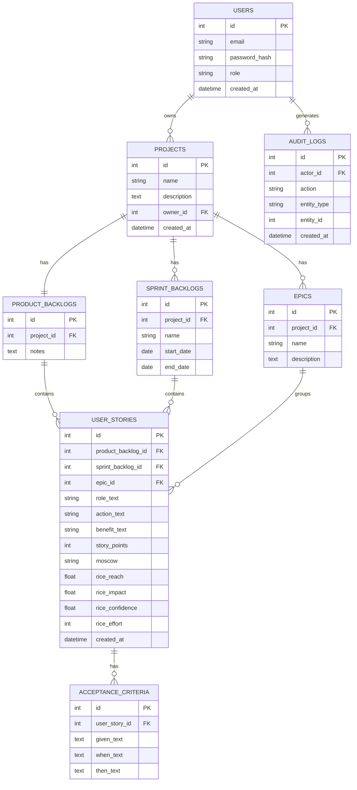

# Physical Database Design

*(Assignment artifact 7: "physical database design", represented by diagram and text. Canonical version for grading: [`docs/pt-BR/database-design.md`](../pt-BR/database-design.md).)*

> Database: **SQLite** (a single file). Object-relational mapping via SQLAlchemy (see `tech-stack.md`, `architecture-notebook.md` §7). Column types below use standard SQL notation (compatible with what SQLAlchemy generates for SQLite).

## Entity-Relationship Diagram

## Table Descriptions

### `users`

**Purpose**: represents an authenticable account in the system, with its RBAC access role.

| Column | Type | Constraints | Description |
|---|---|---|---|
| `id` | INTEGER | PK, autoincrement | Unique identifier. |
| `email` | VARCHAR(255) | UNIQUE, NOT NULL | Login email. |
| `password_hash` | VARCHAR(255) | NOT NULL | Argon2 hash of the password (never the password itself). |
| `role` | VARCHAR(20) | NOT NULL, `CHECK (role IN ('user','admin'))`, default `'user'` | RBAC role (see `non-functional-requirements.md` §3). |
| `created_at` | DATETIME | NOT NULL, default now | Account creation date. |

### `projects`

**Purpose**: the main organizational unit; each project belongs to exactly one owning user.

| Column | Type | Constraints | Description |
|---|---|---|---|
| `id` | INTEGER | PK, autoincrement | Unique identifier. |
| `name` | VARCHAR(200) | NOT NULL | Project name. |
| `description` | TEXT | optional | Free-text description. |
| `owner_id` | INTEGER | FK → `users.id`, NOT NULL | Project owner/creator. |
| `created_at` | DATETIME | NOT NULL, default now | Creation date. |

**Relationships**: N:1 with `users` (a user has N projects); 1:1 with `product_backlogs`; 1:N with `sprint_backlogs` and `epics`.

### `product_backlogs`

**Purpose**: the project's single Product Backlog (assignment requirement 5 — exactly one per project).

| Column | Type | Constraints | Description |
|---|---|---|---|
| `id` | INTEGER | PK, autoincrement | Unique identifier. |
| `project_id` | INTEGER | FK → `projects.id`, **UNIQUE**, NOT NULL | Owning project — `UNIQUE` enforces the 1:1 cardinality. |
| `notes` | TEXT | optional | PO's notes about the backlog. |

### `sprint_backlogs`

**Purpose**: a specific sprint backlog within a project (requirement 6 — N per project).

| Column | Type | Constraints | Description |
|---|---|---|---|
| `id` | INTEGER | PK, autoincrement | Unique identifier. |
| `project_id` | INTEGER | FK → `projects.id`, NOT NULL | Owning project. |
| `name` | VARCHAR(200) | NOT NULL | Sprint name/identifier. |
| `start_date` | DATE | optional | Planned sprint start. |
| `end_date` | DATE | optional | Planned sprint end. |

### `epics`

**Purpose**: a thematic grouping of user stories (requirement 10).

| Column | Type | Constraints | Description |
|---|---|---|---|
| `id` | INTEGER | PK, autoincrement | Unique identifier. |
| `project_id` | INTEGER | FK → `projects.id`, NOT NULL | Owning project. |
| `name` | VARCHAR(200) | NOT NULL | Epic name. |
| `description` | TEXT | optional | Epic description. |

### `user_stories`

**Purpose**: the domain's central entity — a user story, its standardized text (As/I want/So that), its estimate (story points), prioritization (MoSCoW, RICE), and which backlog/epic it belongs to.

| Column | Type | Constraints | Description |
|---|---|---|---|
| `id` | INTEGER | PK, autoincrement | Unique identifier. |
| `product_backlog_id` | INTEGER | FK → `product_backlogs.id`, nullable | Set when the story is in the Product Backlog. |
| `sprint_backlog_id` | INTEGER | FK → `sprint_backlogs.id`, nullable | Set when the story is in a Sprint Backlog. |
| `epic_id` | INTEGER | FK → `epics.id`, nullable | Epic the story is linked to (requirement 11), optional. |
| `role_text` | VARCHAR(200) | NOT NULL | The "As a [role]" part of the standard format (requirement 9). |
| `action_text` | VARCHAR(300) | NOT NULL | The "I want [action]" part. |
| `benefit_text` | VARCHAR(300) | NOT NULL | The "so that [benefit]" part. |
| `story_points` | INTEGER | `CHECK` against {0,1,2,3,5,8,13,21,34,55}, nullable | Requirements 14–15. |
| `moscow` | CHAR(1) | `CHECK (moscow IN ('M','S','C','W'))`, nullable | Requirement 16. |
| `rice_reach` | FLOAT | nullable, ≥ 0 | Requirements 17–18 (number of users). |
| `rice_impact` | FLOAT | `CHECK` against {3, 2, 1, 0.5, 0.25}, nullable | Requirement 18. |
| `rice_confidence` | FLOAT | `CHECK` against {1.0, 0.8, 0.5} (100%/80%/50%), nullable | Requirement 18. |
| `rice_effort` | INTEGER | same `CHECK` as `story_points`, nullable | Requirement 18. |
| `created_at` | DATETIME | NOT NULL, default now | Creation date. |

**Business constraint** (enforced in the service layer, not directly expressible as a simple SQLite `CHECK`): exactly one of `product_backlog_id` and `sprint_backlog_id` must be non-null — a story belongs to a single backlog at a time (requirement 8).

### `acceptance_criteria`

**Purpose**: a story's acceptance criterion, in Given/When/Then format (requirements 12–13).

| Column | Type | Constraints | Description |
|---|---|---|---|
| `id` | INTEGER | PK, autoincrement | Unique identifier. |
| `user_story_id` | INTEGER | FK → `user_stories.id`, NOT NULL, `ON DELETE CASCADE` | Owning story — cascade-deleted when the story is deleted. |
| `given_text` | TEXT | NOT NULL | The "Given [context]" part. |
| `when_text` | TEXT | NOT NULL | The "When [action]" part. |
| `then_text` | TEXT | NOT NULL | The "Then [result]" part. |

### `audit_logs`

**Purpose**: audit record of relevant actions (Epic 9 of the user story backlog), queryable only by the Administrator.

| Column | Type | Constraints | Description |
|---|---|---|---|
| `id` | INTEGER | PK, autoincrement | Unique identifier. |
| `actor_id` | INTEGER | FK → `users.id`, nullable | User responsible for the action (null for login failures with an unregistered email). |
| `action` | VARCHAR(50) | NOT NULL | E.g. `create`, `update`, `delete`, `login`, `logout`, `login_failed`. |
| `entity_type` | VARCHAR(50) | nullable | E.g. `project`, `user_story`, `epic` — null for authentication events. |
| `entity_id` | INTEGER | nullable | Id of the affected entity. |
| `created_at` | DATETIME | NOT NULL, default now | Event timestamp. |

## Notes on Cascading Deletes

- Deleting a `project` cascades to delete its `product_backlogs`, `sprint_backlogs`, `epics`, and all `user_stories` associated with those backlogs (and, in turn, their `acceptance_criteria`) — see US-08.
- Deleting a `sprint_backlog` does **not** delete its `user_stories`: the service layer first reassigns `sprint_backlog_id = NULL` and `product_backlog_id = <the project's backlog>` before removing the sprint record — see US-14.
- Deleting an `epic` only sets `epic_id = NULL` on linked stories (`ON DELETE SET NULL`), never deleting the story — see US-22.

## Encrypted-at-Rest Fields

No field in the schema above is sensitive enough to require encryption in the current MVP (the only credential, `password_hash`, is already an irreversible hash, not an encryption). The `EncryptedString` mechanism described in `architecture-notebook.md` §5–6 is available for immediate use if a sensitive field is added in the future (e.g., a private-notes field on `projects`), with no architecture change required.
