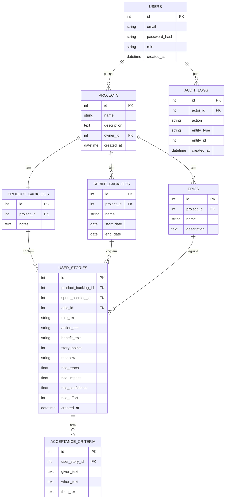

# Projeto Físico de Banco de Dados

*(Artefato 7 do trabalho prático: "projeto físico de banco de dados", representado por diagrama e texto.)*

> Banco de dados: **SQLite** (um único arquivo). Mapeamento objeto-relacional via SQLAlchemy (ver `tech-stack.md`, `architecture-notebook.md` §7). Tipos de coluna abaixo usam a notação SQL padrão (compatível com o que o SQLAlchemy gera para SQLite).

## Diagrama Entidade-Relacionamento

## Descrição das Tabelas

### `users`

**Propósito**: representa uma conta autenticável no sistema, com seu papel de acesso (RBAC).

| Coluna | Tipo | Restrições | Descrição |
|---|---|---|---|
| `id` | INTEGER | PK, autoincrement | Identificador único. |
| `email` | VARCHAR(255) | UNIQUE, NOT NULL | E-mail de login. |
| `password_hash` | VARCHAR(255) | NOT NULL | Hash Argon2 da senha (nunca a senha em si). |
| `role` | VARCHAR(20) | NOT NULL, `CHECK (role IN ('user','admin'))`, default `'user'` | Papel RBAC (ver `non-functional-requirements.md` §3). |
| `created_at` | DATETIME | NOT NULL, default now | Data de criação da conta. |

### `projects`

**Propósito**: unidade organizacional principal; cada projeto pertence a exatamente um usuário dono.

| Coluna | Tipo | Restrições | Descrição |
|---|---|---|---|
| `id` | INTEGER | PK, autoincrement | Identificador único. |
| `name` | VARCHAR(200) | NOT NULL | Nome do projeto. |
| `description` | TEXT | opcional | Descrição livre. |
| `owner_id` | INTEGER | FK → `users.id`, NOT NULL | Dono/criador do projeto. |
| `created_at` | DATETIME | NOT NULL, default now | Data de criação. |

**Relacionamentos**: N:1 com `users` (um usuário tem N projetos); 1:1 com `product_backlogs`; 1:N com `sprint_backlogs` e `epics`.

### `product_backlogs`

**Propósito**: backlog único de produto do projeto (requisito 5 do enunciado — exatamente um por projeto).

| Coluna | Tipo | Restrições | Descrição |
|---|---|---|---|
| `id` | INTEGER | PK, autoincrement | Identificador único. |
| `project_id` | INTEGER | FK → `projects.id`, **UNIQUE**, NOT NULL | Projeto ao qual pertence — `UNIQUE` garante a cardinalidade 1:1. |
| `notes` | TEXT | opcional | Observações do PO sobre o backlog. |

### `sprint_backlogs`

**Propósito**: um backlog de sprint específico dentro de um projeto (requisito 6 — N por projeto).

| Coluna | Tipo | Restrições | Descrição |
|---|---|---|---|
| `id` | INTEGER | PK, autoincrement | Identificador único. |
| `project_id` | INTEGER | FK → `projects.id`, NOT NULL | Projeto ao qual pertence. |
| `name` | VARCHAR(200) | NOT NULL | Nome/identificação da sprint. |
| `start_date` | DATE | opcional | Início planejado da sprint. |
| `end_date` | DATE | opcional | Fim planejado da sprint. |

### `epics`

**Propósito**: agrupador temático de histórias de usuário (requisito 10).

| Coluna | Tipo | Restrições | Descrição |
|---|---|---|---|
| `id` | INTEGER | PK, autoincrement | Identificador único. |
| `project_id` | INTEGER | FK → `projects.id`, NOT NULL | Projeto ao qual pertence. |
| `name` | VARCHAR(200) | NOT NULL | Nome do épico. |
| `description` | TEXT | opcional | Descrição do épico. |

### `user_stories`

**Propósito**: entidade central do domínio — uma história de usuário, seu texto padronizado (Como/Quero/Para), sua estimativa (story points), priorização (MoSCoW, RICE) e a que backlog/épico pertence.

| Coluna | Tipo | Restrições | Descrição |
|---|---|---|---|
| `id` | INTEGER | PK, autoincrement | Identificador único. |
| `product_backlog_id` | INTEGER | FK → `product_backlogs.id`, nullable | Preenchido quando a história está no Product Backlog. |
| `sprint_backlog_id` | INTEGER | FK → `sprint_backlogs.id`, nullable | Preenchido quando a história está em um Sprint Backlog. |
| `epic_id` | INTEGER | FK → `epics.id`, nullable | Épico ao qual a história está vinculada (requisito 11), opcional. |
| `role_text` | VARCHAR(200) | NOT NULL | Parte "Como [papel]" do formato padrão (requisito 9). |
| `action_text` | VARCHAR(300) | NOT NULL | Parte "eu quero [ação]". |
| `benefit_text` | VARCHAR(300) | NOT NULL | Parte "para [benefício]". |
| `story_points` | INTEGER | `CHECK` no conjunto {0,1,2,3,5,8,13,21,34,55}, nullable | Requisitos 14–15. |
| `moscow` | CHAR(1) | `CHECK (moscow IN ('M','S','C','W'))`, nullable | Requisito 16. |
| `rice_reach` | FLOAT | nullable, ≥ 0 | Requisitos 17–18 (número de usuários). |
| `rice_impact` | FLOAT | `CHECK` no conjunto {3, 2, 1, 0.5, 0.25}, nullable | Requisito 18. |
| `rice_confidence` | FLOAT | `CHECK` no conjunto {1.0, 0.8, 0.5} (100%/80%/50%), nullable | Requisito 18. |
| `rice_effort` | INTEGER | mesmo `CHECK` de `story_points`, nullable | Requisito 18. |
| `created_at` | DATETIME | NOT NULL, default now | Data de criação. |

**Restrição de negócio** (aplicada na camada de serviço, não expressável diretamente em `CHECK` simples do SQLite): exatamente um entre `product_backlog_id` e `sprint_backlog_id` deve ser não nulo — uma história pertence a um único backlog por vez (requisito 8).

### `acceptance_criteria`

**Propósito**: critério de aceitação de uma história, no formato Dado/Quando/Então (requisitos 12–13).

| Coluna | Tipo | Restrições | Descrição |
|---|---|---|---|
| `id` | INTEGER | PK, autoincrement | Identificador único. |
| `user_story_id` | INTEGER | FK → `user_stories.id`, NOT NULL, `ON DELETE CASCADE` | História à qual pertence — exclusão em cascata quando a história é excluída. |
| `given_text` | TEXT | NOT NULL | Parte "Dado [contexto]". |
| `when_text` | TEXT | NOT NULL | Parte "Quando [ação]". |
| `then_text` | TEXT | NOT NULL | Parte "Então [resultado]". |

### `audit_logs`

**Propósito**: registro de auditoria de ações relevantes (Épico 9 do backlog de histórias), consultável apenas pelo Administrador.

| Coluna | Tipo | Restrições | Descrição |
|---|---|---|---|
| `id` | INTEGER | PK, autoincrement | Identificador único. |
| `actor_id` | INTEGER | FK → `users.id`, nullable | Usuário responsável pela ação (nulo em falhas de login com e-mail não cadastrado). |
| `action` | VARCHAR(50) | NOT NULL | Ex.: `create`, `update`, `delete`, `login`, `logout`, `login_failed`. |
| `entity_type` | VARCHAR(50) | nullable | Ex.: `project`, `user_story`, `epic` — nulo para eventos de autenticação. |
| `entity_id` | INTEGER | nullable | Id da entidade afetada. |
| `created_at` | DATETIME | NOT NULL, default now | Timestamp do evento. |

## Notas sobre Exclusão em Cascata

- Excluir um `project` exclui em cascata `product_backlogs`, `sprint_backlogs`, `epics` e todas as `user_stories` associadas a esses backlogs (e, por sua vez, seus `acceptance_criteria`) — ver US-08.
- Excluir um `sprint_backlog` **não** exclui suas `user_stories`: a camada de serviço primeiro reatribui `sprint_backlog_id = NULL` e `product_backlog_id = <backlog do projeto>` antes de remover o registro do sprint — ver US-14.
- Excluir um `epic` apenas define `epic_id = NULL` nas histórias vinculadas (`ON DELETE SET NULL`), nunca excluindo a história — ver US-22.

## Campos Cifrados em Repouso

Nenhum campo do schema acima é sensível o suficiente para exigir cifragem no MVP atual (a única credencial, `password_hash`, já é um hash irreversível, não uma cifragem). O mecanismo `EncryptedString` descrito em `architecture-notebook.md` §5–6 fica disponível para uso imediato caso um campo sensível seja adicionado no futuro (ex.: um campo de notas privadas em `projects`), sem necessidade de mudança de arquitetura.
